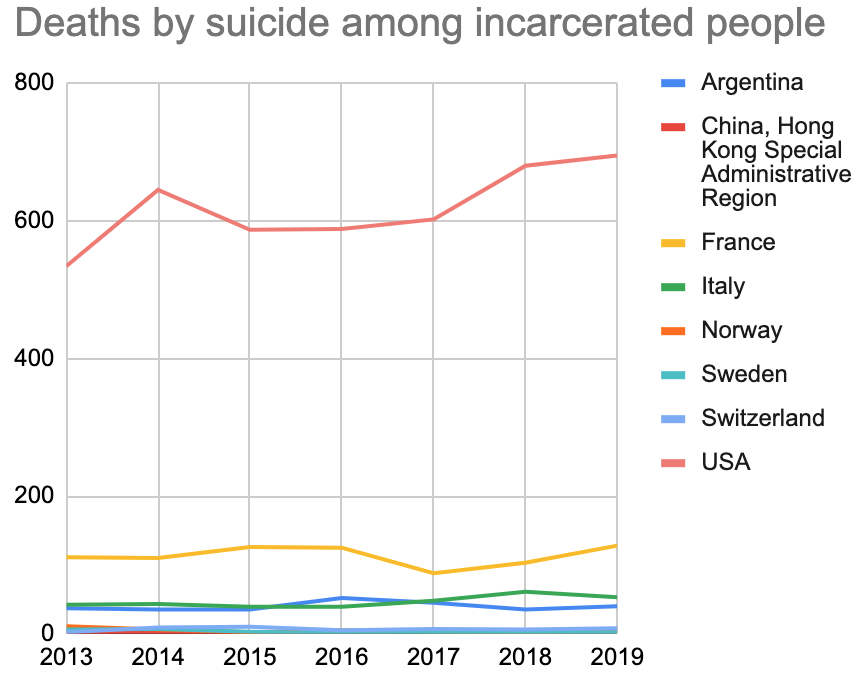
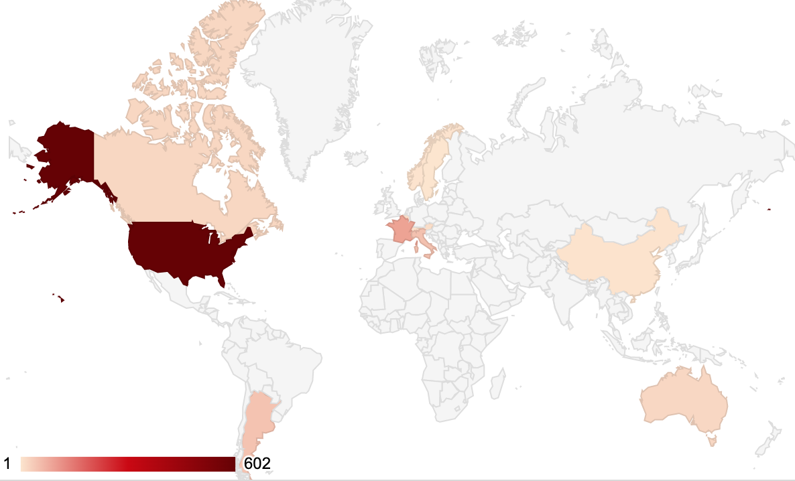
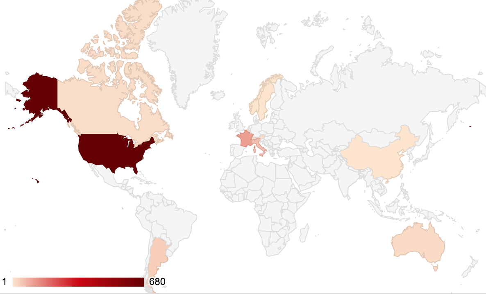

# Major Studio 1
## Data Description

This repository uses data from the UN's Office on Drugs and Crime on incarcerated people by their nationality across the world.
Link: https://dataunodc.un.org/dp-prisons-persons-held
## Design mockup

### Deaths by suicide among incarcerated people in eight countries around the world

### Deaths by suicide in 2017

### Deaths by suicide in 2018

### Deaths by suicide in 2019

## Code prototype
Link to the data: https://docs.google.com/spreadsheets/d/1MXPSSWqqaKiRd8w2gFV5ZNsemQTLgGZh42-IyHDYry8/edit?usp=sharing
